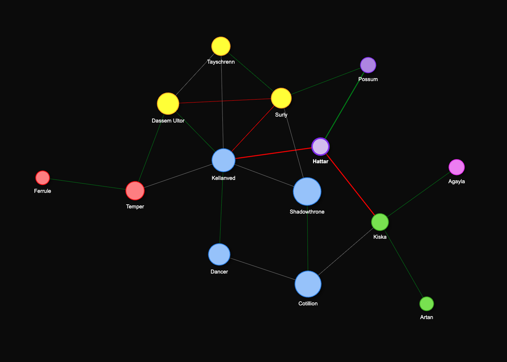

# Malazan_Network2
Network Malazan [take_a_look](https://portfolioontwikkelaar.github.io/malazanWeb_0.1/)
## Layout

 Malazan Character Network
An interactive web-based network visualization of characters from Ian Esslemont’s Malazan Night of Knives.

Built with Python, Flask, NetworkX, and PyVis, this project models:

Character relationships (ally / enemy / unknown)

Power layers (Human / Ascendant / God)

A deliberately chaotic, emergent graph reflecting the complexity of the Malazan world

The visualization allows exploration of how mortals, Ascendants, and gods are interconnected across factions, politics, and divine interference.

Designed as a flexible foundation: characters, relations, and books can easily be expanded or filtered.
